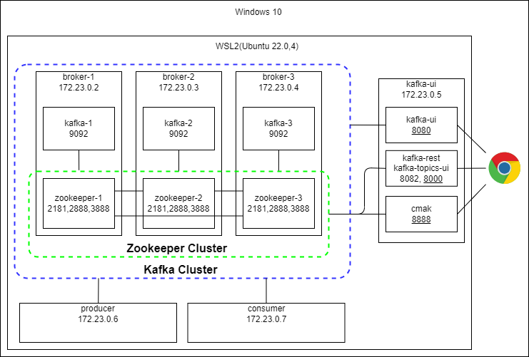
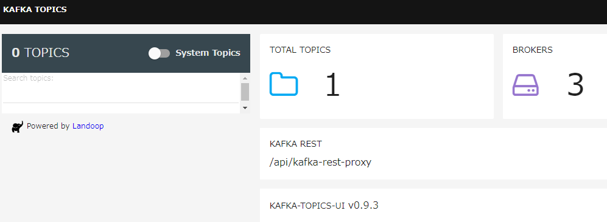
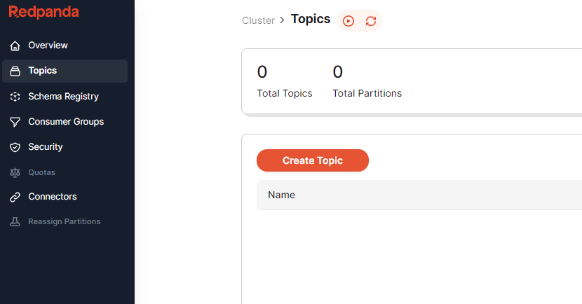
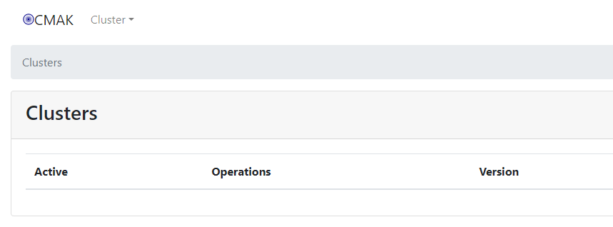
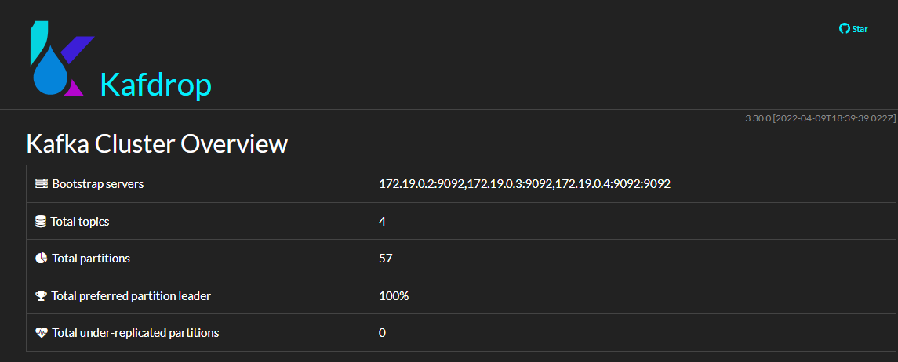
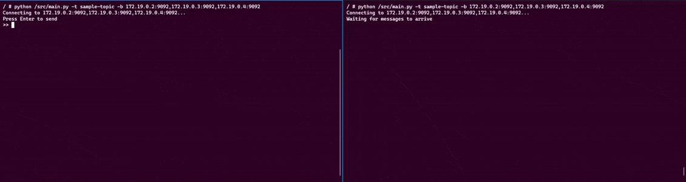
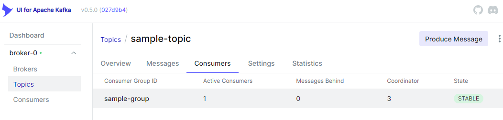

# Docker を活用して複数マシンに Kafka クラスターを構築する方法

- [Docker を活用して複数マシンに Kafka クラスターを構築する方法](#docker-を活用して複数マシンに-kafka-クラスターを構築する方法)
  - [概要](#概要)
  - [準備](#準備)
  - [Kafka クラスターを作成](#kafka-クラスターを作成)
    - [Zookeeper クラスターの構成](#zookeeper-クラスターの構成)
    - [Kafak を起動](#kafak-を起動)
  - [各種 UI の起動](#各種-ui-の起動)
    - [Kafka Topics UI](#kafka-topics-ui)
    - [Redpanda Console](#redpanda-console)
    - [Kafka UI](#kafka-ui)
    - [CMAK(Kafka Manager の後継)](#cmakkafka-manager-の後継)
    - [Kafdrop](#kafdrop)
  - [クライアントからデータを流す](#クライアントからデータを流す)
    - [Producer](#producer)
    - [Consumer](#consumer)
  - [最後に](#最後に)

## 概要



Docker を利用して上記の構成で

- Kafka クラスター
- Kafka UI ツール
- Kafka クライアント(Python)

を構築します.

検証した環境は以下です.

- OS: Ubuntu 22.04 on WSL2(Windows10)
- Docker: 20.10.23
- Docker Compose: v2.15.1

## 準備

コンテナを複数立ち上げ, 複数のサーバーが同一ネットワークにいる環境を仮想的に作成します.

```shell
docker compose up -d
```

各コンテナの IP アドレスを確認します.
下記のコマンドで実行中のコンテナの IP アドレスを表示できます.

```shell
docker ps -q | xargs -n 1 docker inspect --format '{{ .Name }} {{range .NetworkSettings.Networks}} {{.IPAddress}}{{end}}' | sed 's#^/##' | sort -k 2
```

私の実行環境では以下の IP アドレスが割り振らます.
ほかのコンテナを既に起動していたり, `docker0`の設定変更をしている場合は IP が異なるはずです.

```shell
$ docker ps -q | xargs -n 1 docker inspect --format '{{ .Name }} {{range .NetworkSettings.Networks}} {{.IPAddress}}{{end}}' | sed 's#^/##' | sort -k 2
broker-1  172.19.0.2
broker-2  172.19.0.3
broker-3  172.19.0.4
kafka-ui  172.19.0.5
producer  172.19.0.6
consumer  172.19.0.7
```

`broker-1`, `2`, `3` の IP アドレスを`kafka`, `client`ディレクトリ配下の`.env`ファイルに反映します.
`.env`ファイルのテンプレートとして`.env.template`が用意されているので, 同じディレクトリにコピーしてファイルを編集してください.

私の環境ではそれぞれの`.env`ファイルを次のように編集しました.

```env
BROKER1=172.19.0.2
BROKER2=172.19.0.3
BROKER3=172.19.0.4

```

これで準備完了です.
現時点で以下のディレクトリとファイル構成になっているはずです.

```shell
$ tree -a ./kafka
kafka
├── broker-1
│   ├── .env
│   ├── .env.template
│   ├── compose.kafka.yml
│   └── compose.zookeeper.yml
├── broker-2
│   ├── .env
│   ├── .env.template
│   ├── compose.kafka.yml
│   └── compose.zookeeper.yml
├── broker-3
│   ├── .env
│   ├── .env.template
│   ├── compose.kafka.yml
│   └── compose.zookeeper.yml
└── ui
    ├── .env
    ├── .env.template
    ├── compose.cmak.yml
            ...
    └── compose.ui.yml
```

```shell
$ tree -a ./kafka
├── consumer
│   ├── .env
│   ├── .env.template
│   ├── main.py
│   └── requirements.txt
└── producer
    ├── .env
    ├── .env.template
    ├── main.py
    └── requirements.txt
```

各フォルダは後ほど起動するコンテナにそれぞれ volume されています.

## Kafka クラスターを作成

Apache Kafka を動作させるには Apache Zookeeper と接続する必要があります.
まず, Zookeeper クラスターを構成した後, 各ホストで Kafka を起動してクラスターを構成します.

また, 以降の作業は複数のターミナルでの作業をおすすめします.
必要に応じて tmux や Windows ターミナルの split 機能を活用してください.

### Zookeeper クラスターの構成

Zookeeper を `broker-1`, `2`, `3`で起動し, クラスターを構成します.
起動順序は特に指定はありませんが, ここでは ID 順に起動していきます.

コンテナに入ります.

```shell
docker exec -it broker-1 sh
```

Zookeeper を起動します.

```shell
docker compose -f ./src/compose.zookeeper.yml up -d
```

この作業を`broker-1`, `2`, `3`の各コンテナでも実行してください.

### Kafak を起動

Kafka を `broker-1`, `2`, `3`で起動し, クラスターを構成します.
起動時に Zookeeper クラスターに接続しますが, Kafka も起動順序について特に指定はありません.
ここでも ID 順に起動していきます.

Kafka を起動します.

```shell
docker compose -f ./src/compose.kafka.yml up -d
```

この作業を`broker-1`, `2`, `3`の各コンテナでも実行してください.

## 各種 UI の起動

UI 起動用のコンテナに入ります.

```shell
docker exec -it kafka-ui sh
```

利用したい UI ツールを起動してくだい.

### [Kafka Topics UI](https://github.com/lensesio/kafka-topics-ui)

```shell
docker compose -f ./src/compose.topics-ui.yml up -d
```

`localhost:8000`にアクセスすると UI が表示されます.



### [Redpanda Console](https://github.com/redpanda-data/console)

```shell
docker compose -f ./src/compose.redpanda-console.yml up -d
```

`localhost:8080`にアクセスすると UI が表示されます.



### [Kafka UI](https://github.com/provectus/kafka-ui)

```shell
docker compose -f ./src/compose.ui.yml up -d
```

`localhost:8888`アクセスすると UI が表示されます.


### [CMAK](https://github.com/yahoo/CMAK)(Kafka Manager の後継)

```shell
docker compose -f ./src/compose.cmak.yml up -d
```

`localhost:9000`にアクセスすると UI が表示されます.



> NOTE クラスターの追加は手動または[API](https://github.com/yahoo/CMAK/blob/master/conf/routes)で実行する必要がある. 起動時に指定する`ZK_HOSTS`は CMAK を監視するための Zookeeper であって, Kafka クラスターではないため.

### [Kafdrop](https://github.com/obsidiandynamics/kafdrop)

```shell
docker compose -f ./src/compose.kafdrop.yml up -d
```

`localhost:9090`にアクセスすると UI が表示されます.



## クライアントからデータを流す

[kafka-python](https://kafka-python.readthedocs.io/en/master/)を使って実際にメッセージを流してみます.



左がプロデューサー, 右がコンシューマーです.
プロデューサーが送信した文字列をコンシューマーが即時受け取れていることを確認できます.

### Producer

プロデューサー側のコンテナに入ります.

```shell
docker exec -it producer sh
```

ライブラリをインストールします.

```shell
pip install -r /src/requirements.txt
```

Producer を起動します. `--bootstrap-servers`の部分は自身の情報で実行してください.

```shell
python /src/main.py --topic sample-topic --bootstrap-servers 172.19.0.2:9092,172.19.0.3:9092,172.19.0.4:9092
```

文字列を入力し, Enter で Kafka クラスターにメッセージを送信できます.

### Consumer

コンシューマー側のコンテナに入ります.

```shell
docker exec -it consumer sh
```

ライブラリをインストールします.

```shell
pip install -r /src/requirements.txt
```

Producer を起動します. `--bootstrap-servers`の部分は自身の情報で実行してください.

```shell
python /src/main.py --topic sample-topic --bootstrap-servers 172.19.0.2:9092,172.19.0.3:9092,172.19.0.4:9092
```

待ち受け状態で到着したメッセージ標準出力されます.

[各種 UI の起動](#各種-ui-の起動)のセクションで起動したツールで, 到着したメッセージを確認できます.

また, `--group-id`でコンシューマーグループ ID を指定できます.
指定して実行すると UI ツールのコンシューマ一覧に表示されるようになります.



この画像は`--group-id sample-group`とした場合です.

## 最後に

全てのコンテナを落として終了です.

```shell
docker compose down
```

お疲れ様でした!!
