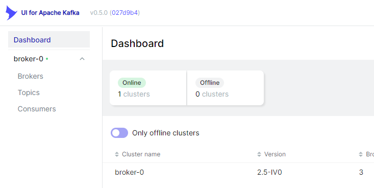

# Kafka Cluster を複数ホストで起動する方法

- [Kafka Cluster を複数ホストで起動する方法](#kafka-cluster-を複数ホストで起動する方法)
  - [概要](#概要)
  - [準備](#準備)
  - [Kafka クラスターを作成](#kafka-クラスターを作成)
    - [Zookeeper を起動](#zookeeper-を起動)
    - [kafak を起動](#kafak-を起動)
  - [各種 UI の起動](#各種-ui-の起動)
    - [Kafka Topics UI](#kafka-topics-ui)
    - [CMAK](#cmak)
    - [Kafka UI](#kafka-ui)

## 概要


Docker を利用して上記の構成で

- Kafka クラスター
- Kafka UI ツール
- Kafka クライアント

を構築します.

## 準備

コンテナを複数立ち上げ, 複数のサーバーが同一ネットワークにいる環境を仮想的に作成します.

```shell
docker compose up -d
```

各コンテナの IP アドレスを確認します.
IP アドレスが下記の順序となっていれば設定変更の必要はありません.
もしも, すでに別のコンテナを起動していたり, `docker0`や`default-address-pools`を変更している場合は`broker-1, 2, 3`の IP アドレスを後ほど利用するので控えておいてください.

```shell
$ docker ps -q | xargs -n 1 docker inspect --format '{{ .Name }} {{range .NetworkSettings.Networks}} {{.IPAddress}}{{end}}' | sed 's#^/##' | sort -k 2
broker-1  172.23.0.2
broker-2  172.23.0.3
broker-3  172.23.0.4
kafka-ui  172.23.0.5
producer  172.23.0.6
consumer  172.23.0.7
```

## Kafka クラスターを作成

Apache Kafka を動作させるには Apache Zookeeper と接続する必要があります.

### Zookeeper を起動

```shell
./src/pull.sh
```

まずは Zookeeper を起動

```shell
docker compose -f ./src/compose.zookeeper.yml up -d
```

### kafak を起動

続いて Kafka を起動

```shell
docker compose -f ./src/compose.kafka.yml up -d
```

## 各種 UI の起動

### Kafka Topics UI

[Kafka Topics UI](https://github.com/lensesio/kafka-topics-ui) の起動

```shell
docker compose -f ./src/compose.topics-ui.yml up -d
```

[localhost:8000](localhost:8000)にアクセスすると UI が表示されます.


### CMAK

[CMAK](https://github.com/yahoo/CMAK)(Kafka Manager の後継)の起動

```shell
docker compose -f ./src/compose.cmak.yml up -d
```

[localhost:8080](localhost:8080)にアクセスすると UI が表示されます.


### Kafka UI

[Kafka UI](https://github.com/provectus/kafka-ui)の起動

```shell
docker compose -f ./src/compose.ui.yml up -d
```

[localhost:8888](localhost:8888)にアクセスすると UI が表示されます.


