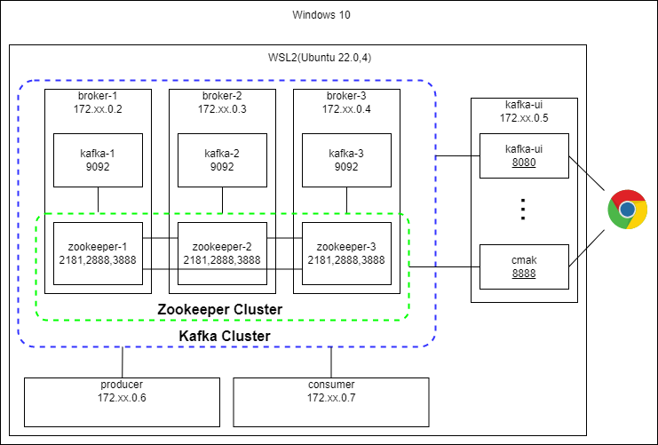

# Kafka Cluster を複数ホストで起動する方法

- [Kafka Cluster を複数ホストで起動する方法](#kafka-cluster-を複数ホストで起動する方法)
  - [概要](#概要)
  - [準備](#準備)
  - [Kafka クラスターを作成](#kafka-クラスターを作成)
    - [Zookeeper クラスターの構成](#zookeeper-クラスターの構成)
    - [Kafak を起動](#kafak-を起動)
  - [各種 UI の起動](#各種-ui-の起動)
    - [Kafka Topics UI](#kafka-topics-ui)
    - [CMAK](#cmak)
    - [Kafka UI](#kafka-ui)

## 概要



Docker を利用して上記の構成で

- Kafka クラスター
- Kafka UI ツール
- Kafka クライアント

を構築します.

検証した環境は以下です.

- OS: Ubuntu 22.04 on WSL2(Windows10)
- Docker: 20.10.23
- Docker Compose: v2.15.1

## 準備

コンテナを複数立ち上げ, 複数のサーバーが同一ネットワークにいる環境を仮想的に作成します.

```shell
docker compose up -d
```

各コンテナの IP アドレスを確認します.
下記のコマンドで実行中のコンテナの IP アドレスを表示できます.

```shell
docker ps -q | xargs -n 1 docker inspect --format '{{ .Name }} {{range .NetworkSettings.Networks}} {{.IPAddress}}{{end}}' | sed 's#^/##' | sort -k 2
```

私の実行環境では以下の IP アドレスが割り振らます.
ほかのコンテナを既に起動していたり, `docker0`の設定変更をしている場合は IP が異なるはずです.

```shell
$ docker ps -q | xargs -n 1 docker inspect --format '{{ .Name }} {{range .NetworkSettings.Networks}} {{.IPAddress}}{{end}}' | sed 's#^/##' | sort -k 2
broker-1  172.18.0.2
broker-2  172.18.0.3
broker-3  172.18.0.4
kafka-ui  172.18.0.5
producer  172.18.0.6
consumer  172.18.0.7
```

broker-1, 2, 3 の IP アドレスを`kafka`ディレクトリ配下の`.env`ファイルに反映します.
`.env`ファイルのテンプレートとして`.env.template`が用意されているので, 同じディレクトリにコピーしてファイルを編集してください.

私の環境ではそれぞれの`kafka/*/.env`ファイルを次のように編集しました.

```env
BROKER1=172.18.0.2
BROKER2=172.18.0.3
BROKER3=172.18.0.4

...
```

これで準備完了です.
現時点で以下のディレクトリとファイル構成になっているはずです.

```shell
$ tree -a ./kafka
kafka
├── broker-1
│   ├── .env
│   ├── .env.template
│   ├── compose.kafka.yml
│   └── compose.zookeeper.yml
├── broker-2
│   ├── .env
│   ├── .env.template
│   ├── compose.kafka.yml
│   └── compose.zookeeper.yml
├── broker-3
│   ├── .env
│   ├── .env.template
│   ├── compose.kafka.yml
│   └── compose.zookeeper.yml
└── ui
    ├── .env
    ├── .env.template
    ├── compose.cmak.yml
    ├── compose.topics-ui.yml
    └── compose.ui.yml
```

各フォルダは`broker-1`, `2`, `3`, `kafka-ui`にそれぞれ volume されています.

## Kafka クラスターを作成

Apache Kafka を動作させるには Apache Zookeeper と接続する必要があります.
まず, Zookeeper クラスターを構成した後, 各ホストで Kafka を起動してクラスターを構成します.

また, 以降の作業は複数のターミナルでの作業をおすすめします.
必要に応じて tmux や Windows ターミナルの split 機能を活用してください.

### Zookeeper クラスターの構成

Zookeeper を `broker-1, 2, 3`で起動し, クラスターを構成します.
起動順序は特に指定はありませんが, ここでは ID 順に起動していきます.

コンテナに入ります.

```shell
docker exec -it broker-1 sh
```

Zookeeper を起動します.

```shell
docker compose -f ./src/compose.zookeeper.yml up -d
```

この作業を`broker-1`, `2`, `3`の各コンテナでも実行してください.

### Kafak を起動

Kafka を `broker-1`, `2`, `3`で起動し, Zookeeper と接続した上でクラスターを構成します.
Kafka の起動順序も特に指定はありません.
ここでも ID 順に起動していきます.

Kafka を起動します.

```shell
docker compose -f ./src/compose.kafka.yml up -d
```

この作業を`broker-1`, `2`, `3`の各コンテナでも実行してください.

## 各種 UI の起動

UI 起動用のコンテナに入ります.

```shell
docker exec -it kafka-ui sh
```

利用したい UI ツールを起動してくだい.

### Kafka Topics UI

[Kafka Topics UI](https://github.com/lensesio/kafka-topics-ui) の起動

```shell
docker compose -f ./src/compose.topics-ui.yml up -d
```

`localhost:8000`にアクセスすると UI が表示されます.


### CMAK

[CMAK](https://github.com/yahoo/CMAK)(Kafka Manager の後継)の起動

```shell
docker compose -f ./src/compose.cmak.yml up -d
```

`localhost:8080`にアクセスすると UI が表示されます.


### Kafka UI

[Kafka UI](https://github.com/provectus/kafka-ui)の起動

```shell
docker compose -f ./src/compose.ui.yml up -d
```

`localhost:8888`アクセスすると UI が表示されます.


